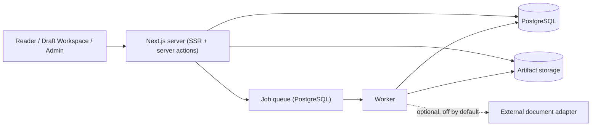

# Architecture

## Shape of the system



One process serves the UI and the domain API; a second process drains the job
queue. Both are the same image. The only required infrastructure is PostgreSQL
and a writable artifact directory.

## Stack decisions

| Decision | Why |
|---|---|
| TypeScript + Next.js App Router (SSR) | The reader must render without JavaScript, and the first paint has to be the document itself. Server components make that the default rather than an optimisation. |
| PostgreSQL as the only datastore | Documents, revisions, review state, audit and the job queue are one transactional world. Introducing a broker would put the publish transaction across two systems. |
| Drizzle ORM with checked-in SQL migrations | Migrations are reviewable SQL, and the trigger-based guarantees below live in the same files as the tables they protect. |
| A job queue inside PostgreSQL (`FOR UPDATE SKIP LOCKED`) | Publication and rendering must be transactional with the data they touch. A separate broker would add an operational dependency for no gain at this scale. |
| Own Markdown/RFCXML parser and renderer | Anchors, pagination and artifact bytes must be deterministic and identical across formats, and the HTMLizer must guarantee that linkification changes no visible character. A general-purpose Markdown library gives none of those guarantees. |
| Own diff, PDF and XML writers | Same reason, plus it keeps the runtime dependency list to `next`, `react`, `pg`, `drizzle-orm` and `zod`. Fewer moving parts to audit for a self-hosted product. |
| Cookie sessions with scrypt password hashing | No external identity provider is required to run the product. Nothing prevents adding one at the `services/auth.ts` boundary. |

## Domain boundaries

```
src/
  domain/      vocabulary, lifecycle rules, typed errors — no I/O
  parser/      source text  -> normalized document tree
  render/      document tree -> plaintext, HTML pages, RFCXML, PDF, BibTeX
  diff/        line diff and the four presentation views
  services/    domain operations over the database (the only place that writes)
  jobs/        queue, worker loop and job handlers
  adapters/    optional external document import
  app/         routes, server actions and UI
  components/  presentation
```

The rule that keeps this honest: `parser`, `render` and `diff` are pure. They
take strings and structures and return strings and structures. They never touch
the database, the filesystem, the clock or the network. Everything that can be
tested without a database is tested without one.

### Canonical content vs. document context

The specification's central separation is enforced by the module layout:

- **Canonical content** is the immutable source of a revision plus everything
  derived from it. It is produced by `parser` + `render` and stored as artifacts.
- **Document context** is identity, lifecycle, people, relations, provenance and
  policy. It lives in the database and is assembled by `services/documents.ts`.

The reader composes them; neither knows about the other's storage.

## Immutability

Three layers, deliberately overlapping:

1. **Model** — a revision row carries `isImmutable`; the working copy lives on
   the document, not on any revision.
2. **Application** — `assertEdit` refuses to edit a published document;
   `createRevision` only ever inserts.
3. **Database** — a trigger (`revisions_immutability`) rejects any UPDATE that
   changes a revision's source, checksum, format, sequence or creation time, and
   any DELETE of a published revision. A second trigger makes `audit_events`
   append-only.

The database layer exists because the first two can be bypassed by a bug, a
migration script or a console session. The integration suite asserts that the
triggers fire.

The seed script is the one place that disables both triggers — to backdate the
demo history so the timeline has something to show — and it re-enables them in a
`finally` block.

## Draft family and published document

A publication does **not** mutate the draft. It creates a second document row in
the same `familyKey`:

```
familyKey: DRAFT-TEST-STD-0001
├── DRAFT-TEST-STD-0001   status: historic     revisions 00, 01, …
└── TEST-STD-0001         status: published    revision "Published 1.0"
```

This is what lets the Status timeline show a draft row and a published row on one
time axis, what makes "Was draft" a real relation rather than an inference, and
what keeps every draft revision readable at its own URL after publication.

The alternative — renaming the draft in place — would destroy the distinction
between "the draft that became the standard" and "the standard", and would make
the timeline unrepresentable.

## Render pipeline

```
source (Markdown | RFCXML)
   → parse            → normalized document tree + diagnostics + anchor map
   → renderPlaintext  → paginated fixed-width text (two passes: the first
                        establishes page numbers, the second fills them into
                        the table of contents without changing line counts)
   → htmlize          → one <pre> per page, escaped, with page/section anchors
                        and linkified references
   → artifacts        → txt, html, xml, source, pdf, bibtex
```

Determinism is a requirement, not a nicety: the same source and the same
parser/renderer versions must produce the same bytes and the same anchor map,
because approvals, publications and cached renders are all keyed on checksums.
No timestamps or random ids enter the artifacts.

The reader caches rendered pages in-process, keyed by
`(revision, parserVersion, rendererVersion, htmlization mode, citation mode)`.
Nothing about the request or the viewer influences the output, so the cache can
be shared across users.

### Two reading modes

- `HTMLize the plaintext` (default) renders from the canonical plaintext.
- `Plaintextify the HTML` reads the stored HTML artifact, sanitizes it and
  converts it back into the document tree, then runs the same paginator. This is
  what makes an imported upstream document read exactly like a local one.

Both modes are server-rendered. The two preferences that change server output are
mirrored into a cookie so the first paint already matches the user's choice.

## Publish transaction

`executePublish` runs as one database transaction:

1. Re-evaluate the approval gates.
2. Lock the draft row (`FOR UPDATE`).
3. Allocate the document number by incrementing the namespace sequence.
4. Create the published document row and its publication revision.
5. Copy authors, editors and relations; record the `was` relation.
6. Render and store every artifact.
7. Write the manifest and the publication row.
8. Apply supersede relations, close out the draft family.
9. Record the audit event.

If any step throws, nothing is visible. The job is idempotent: a retry finds the
publication through the published document's derivation and returns it unchanged
rather than allocating a second number.

Artifacts are written to storage inside the transaction. Storage is not
transactional, so a rollback can leave orphan files — they are content-addressed
and harmless, and the alternative (publishing a document whose artifacts do not
exist yet) is not acceptable.

## Approval integrity

An approval stores the revision's `sourceSha256`. A gate is satisfied only by
approvals whose stored checksum equals the current revision's checksum.
`createRevision` additionally marks older approvals stale in the same
transaction that inserts the new snapshot. Either mechanism alone would be
enough; together they make "approved content" and "published content" the same
bytes by construction.

## One event stream

The Status timeline and the History tab both read `audit_events` plus the
revision and publication rows. There is no second, hand-maintained timeline
record. `LifecycleSegment` is a computed read model (`services/timeline.ts`), not
a table, so the two screens cannot disagree.

## Notification expansion

Policies are resolved global → namespace → group → document, ordered by scope
then precedence. Later scopes add selectors; a `suppress` list removes them.
Every resolved recipient records which selector and which policy pulled it in,
which is what the Email expansions screen displays.

Policies are versioned rather than mutated: saving supersedes the previous row
and writes an audit event. Preview computes an expansion and never creates a
delivery. Actual delivery is a separate `NotificationDelivery` record with its
own status; with no transport configured it is recorded as `skipped` rather than
silently dropped.

## Optional external adapter

`adapters/external.ts` is the only module allowed to make outbound requests, and
only to hosts in the allowlist derived from configuration. It is inert unless
`EXTERNAL_IMPORT_ENABLED=true`. No service imports it directly; the job handler
does, behind the same flag. Upstream field or URL changes therefore cannot reach
a UI component.

## Performance posture

- Parsing and rendering happen on the server and are cached by checksum.
- Sidebar state changes never re-render the document: the pages are inert HTML
  passed into a client shell as a prop.
- Section navigation uses real anchors, so browser find, deep links and print all
  keep working — no virtualization that would break them.
- History, referenced-by and relation lists are paginated server-side; history
  search runs in SQL over the whole authorized set, not over the current page.
- The editor debounces autosave and preview instead of parsing on every
  keystroke.

## Known limitations

- Concurrent editing is optimistic-locking with an explicit conflict screen, not
  real-time collaboration. The boundary is `saveWorkingCopy`; a CRDT/OT adapter
  would slot in there.
- The S3 storage adapter is defined but not implemented; `ARTIFACT_STORAGE=s3`
  fails loudly rather than silently falling back to local disk.
- Notification transport is not implemented. Expansion, policy management,
  preview and delivery records are; the send step is a deliberate seam.
- Migration `0001` adds self-referencing foreign keys and the trigger guards as
  hand-written SQL. `drizzle-kit generate` does not know about them, so a future
  generated migration will not try to drop them — but they must be maintained by
  hand.
- The PDF writer emits base-14 Courier only. It is sufficient for the paginated
  plaintext rendering and adds no font-embedding dependency, but it cannot
  represent non-Latin-1 characters (they are replaced with `?`).
