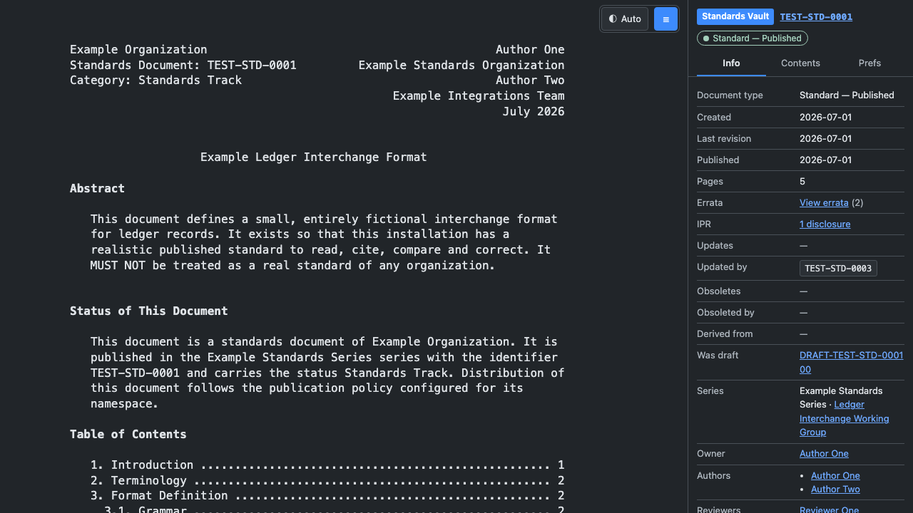

# DraftLedger

[](https://github.com/bkoroglu1/draftledger/actions/workflows/ci.yml)
[](LICENSE)
[](package.json)

Self-hosted platform for writing, reviewing, publishing and reading an
organization's own RFC-style technical standards.

DraftLedger is not a copy of, or a client for, any external standards
organization. Documents live in your own namespace (`ORG-RFC-0042`,
`TEST-STD-0001`, whatever you configure), authored by your own users, reviewed
by your own groups and published under your own policy. An optional, disabled
by default adapter can additionally import external documents as read-only
references.



## What it does

- **Reader** — a full-viewport, fixed-width, paginated reading surface with a
  document metadata panel (Info / Contents / Prefs), light/dark/auto themes,
  a `7–16pt` font control, and working section, page, citation and cross-document
  links.
- **Draft Workspace** — in-browser Markdown or RFCXML authoring with live
  preview from the *publishing* renderer, an outline, validation diagnostics,
  autosave, conflict-safe concurrent editing and immutable revision snapshots.
- **Review** — review rounds pinned to an immutable revision, anchored comment
  threads, blocking change requests, and thread carry-forward between revisions.
- **Approval and publication** — configurable approval gates, approvals bound to
  a revision checksum (a source change makes them stale), and a single atomic
  publish transaction that allocates the number, locks the snapshot, generates
  every artifact and only then flips the document to published.
- **After publication** — published revisions are immutable. Corrections are made
  through errata; changes are made through a new `updates` or `obsoletes`
  document.
- **Provenance** — a lifecycle timeline, a searchable append-only audit history,
  reference graphs in both directions, and notification recipient expansion that
  explains *who* would be notified and *why*.

Everything above works with no internet connection.

## Quick start with Docker

```bash
cp .env.example .env
docker compose up --build
```

This starts PostgreSQL, applies the migrations, seeds a fictional demo
installation, starts the web application on <http://localhost:3000> and starts a
background worker.

Sign in with any of the seeded accounts (all use the password `draftledger`):

| Handle        | Role      | Can do                                          |
|---------------|-----------|-------------------------------------------------|
| `admin-1`     | admin     | everything, including namespaces and policies   |
| `publisher-1` | publisher | run the publish transaction                     |
| `approver-1`  | approver  | record approval decisions                       |
| `reviewer-1`  | reviewer  | open threads and request changes                |
| `author-1`    | author    | create and edit drafts                          |
| `author-2`    | editor    | structural and editorial edits                  |
| `reader-1`    | reader    | read what they are permitted to read            |

Seeded documents: `TEST-STD-0001` (short published standard), `TEST-STD-0002`
(long, deeply nested), `TEST-STD-0003` (an update of 0001) and
`DRAFT-TEST-PROTOCOL` (a working draft with review threads and a pending
approval). Every fixture is fictional.

## Local development

Requirements: Node 22+ and PostgreSQL 16+.

```bash
npm install
cp .env.example .env.local     # point DATABASE_URL at your database
npm run db:migrate
npm run db:seed
npm run dev                    # http://localhost:3000
npm run worker                 # in a second terminal
```

The worker runs rendering, publication, notification and (optional) import
jobs. The application works without it, but rendering and publishing then stay
queued.

### Useful commands

| Command                   | Purpose                                              |
|---------------------------|------------------------------------------------------|
| `npm run dev`             | development server                                    |
| `npm run worker`          | background job worker                                 |
| `npm run db:migrate`      | apply pending migrations                              |
| `npm run db:seed`         | seed the fictional fixtures (refuses over live data)  |
| `npm run db:reset`        | drop and recreate the schema (needs `DRAFTLEDGER_ALLOW_RESET=yes`) |
| `npm run typecheck`       | TypeScript                                            |
| `npm run lint`            | ESLint                                                |
| `npm test`                | unit tests                                            |
| `npm run test:integration`| integration tests (needs a seeded database)           |
| `npm run test:e2e`        | Playwright end-to-end tests                           |
| `npm run verify`          | typecheck + lint + unit tests                         |

## Writing a document

1. **Create** — `New document` offers a blank standard, an organization
   template, a copy, an update or obsoleting document, a fork, or an import of a
   Markdown/RFCXML file. A draft identifier such as `DRAFT-LEDGER-NOTIFY` is
   assigned immediately; the published number is allocated only at publication.
2. **Write** — the editor autosaves the working copy and shows a live preview
   produced by the same renderer that publication uses. The diagnostics panel
   reports broken cross references, unresolved citations, duplicate anchors and
   missing required sections, each with a line number and a fix hint.
3. **Snapshot** — `Create revision` stores an immutable snapshot with a checksum,
   a change summary and the parser/renderer versions used.
4. **Review** — sending for review creates a snapshot and opens a round pinned to
   it. Reviewers open threads anchored to sections. A blocking thread moves the
   document to `changes-requested` and blocks publication until it is resolved.
5. **Approve** — approvers record a decision per gate. The decision is bound to
   the revision checksum; a later edit makes it stale automatically.
6. **Publish** — a publisher runs the transaction. Gates are re-checked, the
   number is allocated, artifacts (`txt`, `html`, `xml`, source, `pdf`, `bibtex`)
   are generated and the document becomes visible as published. The draft family
   stays readable forever as history.

### Organization templates

`Admin → Templates` creates, edits and deletes the skeletons offered by step 1.
A template carries a name, a unique key, a canonical format and a body in which
`{{title}}`, `{{shortName}}` and `{{abstract}}` are substituted at creation time.

The body is copied into the draft's first revision, so a template is never
consulted again: editing or deleting one cannot change a document that already
exists. Which sections a document *must* contain is not a template property — it
is the `required-sections` gate on the workflow, which is what validation and
publication actually check.

### Authoring format

Documents are written in RFC-flavoured Markdown (default) or RFCXML. Both parse
into the same document model, so the output is identical either way.

```markdown
---
title: Example Ledger Interchange Format
abbrev: Example Ledger Format
---

# Abstract

One paragraph.

# Introduction

Cross-reference with {{section-2}}, cite with [EXAMPLE-KEY], link with
<https://example.invalid/spec>.

# Format Definition

```abnf
record = account SP amount CRLF
```

# Security Considerations

Implementations MUST validate input length.

# Normative References

[EXAMPLE-KEY]  Example Org, "Referenced document", TEST-STD-0002, 2026.

# Appendix A: Notes
```

Supported: front matter, `{#explicit-anchor}` and `{-}` heading modifiers,
fenced artwork (never reflowed), `:::note` callouts, pipe tables, nested lists,
definition lists, block quotes and reference sections.

## Correcting a published document

Published artifacts are never rewritten.

- **Typo or wording error** → file an erratum (`/doc/<id>/errata/new`). Once
  verified it is displayed alongside the published text.
- **Normative change** → start an update draft; publication records an `updates`
  relation.
- **Full replacement** → start a new draft that `obsoletes` the old document; the
  old one moves to `superseded` at publication.
- **Retraction** → an admin moves the document to `withdrawn` or `historic`. The
  artifacts and the audit trail are kept.

## Optional external import

Disabled by default. To enable:

```dotenv
EXTERNAL_IMPORT_ENABLED=true
SYNC_MODE=on-demand          # or mirror
UPSTREAM_DATATRACKER_BASE=https://datatracker.ietf.org
UPSTREAM_RFC_EDITOR_BASE=https://www.rfc-editor.org
```

Imported documents are read-only, carry their provenance and last-sync state,
and can be forked into a local draft. The server only ever contacts the hosts in
the configured allowlist, and only for references matching a narrow pattern.
Every local capability keeps working with the adapter switched off.

## People, teams and access

`Admin → People` and `Admin → Teams` manage accounts and membership.

Access is decided by two layers, combined with OR:

| Layer | Where it is set | Scope |
|---|---|---|
| Organization role | `Admin → People` | Everywhere. Ranked: `reader < author < editor < reviewer < approver < publisher < admin` |
| Team role | `Admin → Teams` | That team's documents only. `owner`, `reviewer`, `approver`, `publisher`, `member` |

So `canApprove` is satisfied by an organization role of `approver` or above, **or**
by holding `approver` in the team that owns the document. Someone can hold more
than one role in a team.

### Credentials

An administrator never sees an existing password: only a hash is stored. To give
someone access:

- **Generate a password** — shown once, copyable, and never displayed again.
- **Set a password directly** — 12 characters minimum.
- **Issue an invite or reset link** — single use, and invalidates any earlier
  link of the same kind. Invite links last a week, reset links an hour
  (`INVITE_TTL_SECONDS`, `RESET_TTL_SECONDS`). The link is either copied from the
  screen or emailed, which needs `SMTP_HOST` and `SMTP_FROM`.

Setting a password or redeeming a link signs that account out of every existing
session. Only the token's hash is stored, so a database dump cannot be replayed
into a working link. Password resets are administrator-initiated: there is no
public "forgot password" endpoint to probe for account names.

People are deactivated, never deleted. The audit trail is append-only and refuses
the cascade that deleting a person would require, which is the behaviour you
want — someone who authored a document stays attributable forever.

### Email

With no `SMTP_HOST`/`SMTP_FROM` configured the application sends nothing:
notification deliveries are recorded with `status = skipped` and
`error_class = no_transport_configured`, and invite links can only be copied.
Configuring SMTP enables both notification delivery and credential emails.

## Backup and restore

Two things need backing up: the PostgreSQL database and the artifact volume.

```bash
# Backup
docker compose exec db pg_dump -U draftledger draftledger > backup.sql
docker run --rm -v draftledger_artifacts:/data -v "$PWD:/backup" alpine \
  tar czf /backup/artifacts.tar.gz -C /data .

# Restore
docker compose exec -T db psql -U draftledger draftledger < backup.sql
docker run --rm -v draftledger_artifacts:/data -v "$PWD:/backup" alpine \
  tar xzf /backup/artifacts.tar.gz -C /data
```

Restore both from the same point in time: artifacts are referenced by rows in
the database, and a database restored ahead of its artifacts will point at files
that do not exist.

Startup never destroys data. `migrate-and-seed` seeds only when the database is
empty, and `db:reset` refuses to run without an explicit confirmation variable.

## Troubleshooting

| Symptom | Cause and fix |
|---|---|
| `docker compose up` fails to bind port 5432 | Another PostgreSQL is already listening on the host. Stop it, or drop the `ports` mapping from the `db` service — `web` and `worker` reach the database over the compose network and do not need it published. |
| An invite or reset link says it cannot be used | It was already redeemed, it expired, a newer link of the same kind superseded it, or the account is deactivated. Issue a new one. |
| A notification delivery shows `no_transport_configured` | `SMTP_HOST` or `SMTP_FROM` is unset, so nothing was sent. The delivery row records that rather than dropping it. |
| An invite link points at the wrong host | Links are built from `APP_BASE_URL`. Set it to the address people actually reach. |
| A revision stays in `render_state = pending` | The worker is not running. Start `npm run worker` or the compose `worker` service. |
| `/health/ready` returns 503 | The database is unreachable. Check `DATABASE_URL` and that PostgreSQL accepts connections. |
| "This draft was changed by someone else" | Two editors saved concurrently. Your text is preserved in the editor; copy it out, reload and reapply. |
| Publication rejected with `unresolved_gate` | Open the Publish tab: each unmet gate lists exactly what is blocking it. |
| Publication rejected with `stale_approval` | The source changed after approval. Re-approve the current revision. |
| An artifact download fails with `not_synced` | The database has the artifact but the file is gone — usually a restore that brought the database back without its artifact volume. Restore the volume from the same point in time, or re-render the revision. |
| An imported document shows `sync error` | Upstream was unreachable, or the reference did not match the allowed pattern. The last successful copy is still served. |
| Errata cannot be filed | The document is not published yet, or you are not signed in. |
| Reader shows "no sections were extracted" | The source has no headings, or the parser failed — check the diagnostics panel in the editor. |

## Documentation

- [ARCHITECTURE.md](ARCHITECTURE.md) — domain boundaries, immutability, render
  and publish pipelines, data flow, and the decisions behind them.
- [SECURITY.md](SECURITY.md) — RBAC, draft confidentiality, approval integrity,
  sanitization and the upstream-fetch threat model.
- [LICENSES.md](LICENSES.md) — third-party dependencies and attribution.
- `docs/screenshots/` — captured interface screenshots
  (`node scripts/screenshots.mjs http://localhost:3000` regenerates them).

## Contributing

Bug reports, feature proposals and pull requests are welcome. Start with
[CONTRIBUTING.md](CONTRIBUTING.md) — it covers the development setup, the test
gate that CI enforces, and the design constraints a change has to respect.

## Security

Found a vulnerability? **Please do not open a public issue.** Report it
privately through
[GitHub Security Advisories](https://github.com/bkoroglu1/draftledger/security/advisories/new).
[SECURITY.md](SECURITY.md) documents the threat model, what is in scope, and
what to expect after you report.

## Licence

DraftLedger is free software under the
[GNU Affero General Public License v3.0](LICENSE).

You may run, study, share and modify it. The AGPL adds one obligation beyond the
GPL that matters for a self-hosted web application: **if you run a modified
version as a network service, you must offer its source to the people using
it.** DraftLedger ships an `/about` page for exactly this, driven by
`APP_SOURCE_URL` — if you deploy modified code, point that variable at your own
repository.

Everything under `seed/` is fictional. It contains no real person,
organization or standard, and carries no third-party licence obligation.
